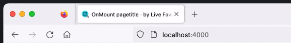
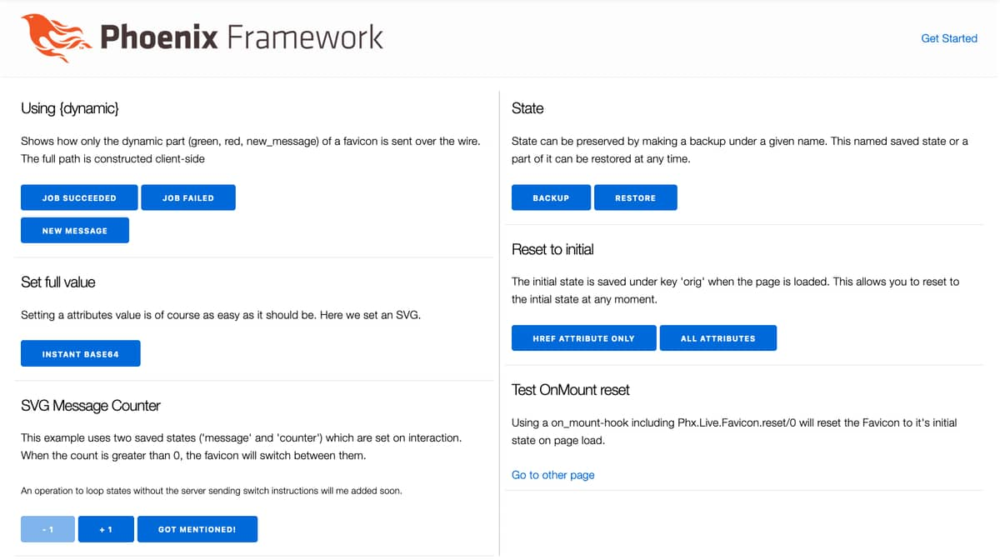

[](https://github.com/BartOtten/phoenix_live_favicon/actions/workflows/elixir.yml)
[](https://github.com/BartOtten/phoenix_live_favicon/commits/main)
[](https://hex.pm/packages/phoenix_live_favicon)


# Phoenix Live Favicon



A lib enabling dynamic favicons in Phoenix Live View applications.

To show...
- ...a message counter
- ...the result of a CI/CD job
- ...a summary of all monitor statuses
- ...a spinner while uploading a file

Using a dynamic favicon allows users to view a status without
having the page in front.


## Status
Although updates may appear infrequent, the repository remains solid and fully operational.


## Basic Operations
- set or remove any attribute
- add a class name or remove a class name
- toggle a class


## Special Operations
In addition to these basic operations this library includes some
special operations to help with common use cases.

**Reset a favicon to its initial value**  
The initial attribute values of favicons are preserved on the first load
of the website and can be restored using `reset/0`. This is in particular
useful to erase all previous changes when a user visits a new
page by including `reset/0` in the `on_mount` hook.

**Set the value of a placeholder (mimicking Phoenix's assign)**  
Common use cases are:

- Changing the path of favicons when multiple sizes are defined
- Changing a dynamic value within an SVG favicon

**Create and restore snapshots**  
By creating a snapshot of the favicon after multiple operations, you can
restore the favicons' attributes by only sending the snapshots' name over
the wire.


## Documentation
Visit the documentation of [Phx.Live.Favicon module](https://hexdocs.pm/phoenix_live_favicon/Phx.Live.Favicon.html)
for the full list of operations.


## Guides and Example
See the [Guides page](https://hexdocs.pm/phoenix_live_favicon/guides.html) for common use cases.
The [Example App](https://github.com/BartOtten/phoenix_live_favicon_example/) demonstrates various
use cases and includes a 'debug frame' which shows the HTML of favicon head elements in real time.



To start this example:

- Run `git clone https://github.com/BartOtten/phoenix_live_favicon_example`
- Go inside the folder with `cd phoenix_live_favicon_example`
- Install dependencies with `mix deps.get`
- Start Phoenix endpoint with `mix phx.server` or inside IEx with `iex -S mix phx.server`


## Installation
The package can be installed by adding `phoenix_live_favicon` to your list of dependencies in `mix.exs`:

```diff
def deps do
  [
+    {:phoenix_live_favicon, "~> 0.2.0"}
  ]
end
```

To include the necessary client side Javascript, import the Javascript module 
from dependency [Phoenix Live Head](https://github.com/BartOtten/phoenix_live_head) in `assets/js/app.js`

```diff
import "phoenix_html"
// Establish Phoenix Socket and LiveView configuration.
import { Socket } from "phoenix"
import { LiveSocket } from "../vendor/phoenix_live_view/"
import topbar from "../vendor/topbar"
+ import "phoenix_live_head"
```
